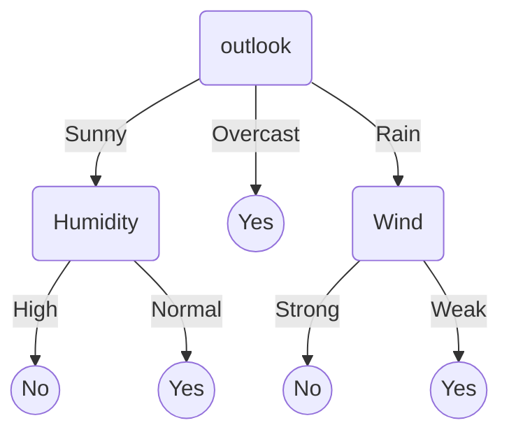

Decision trees are used to learn discrete valued target functions. It's main advantage is that it classifies data by sequence of interpretable steps. Each node tests one attribute and each branch corresponds to one attribute value. The leaf nodes assign a classification. A decision tree can also be written as a disjunction of conjunction.



This tree corresponds to: $$\neg ((Outlook=Sunny \wedge Humidity=High) \vee (Outlook=Rain \wedge Wind=String))$$


### When to consider decision trees
- instances are describable by attribute-value pairs
- target function is discrete valued
- disjunctive hypothesis may be required
- possibly noisy training data

Decision trees are a good choice if it is required to understand how a classification was made. Just follow the decision path to understand what attributes/attribute-values contributed to a decision.


### Top-down induction of decision trees
Learning a decision tree means finding the best order to ask the attribute values.
- "best" means we want a small tree
- mist algorithms employ a top down, greedy search among possible decision trees
- most of the time **ID3** (Iterative Dichotomizer 3 by Quinlan, 1986) algorithm is used
- put most informative attribute at the root, every branch stands for one of its values
- iteratively attach best attributes to branches


### Entropy and Information Gain
#### Entropy
Simply put, information entropy is a *measure of disorder/purity*.\
The formula for entropy is: $$E(S) = \sum_{i=1}^c -p_i log_2 p_i$$\
In our case c is 2 because our classes are either positive or negative. Therefore we can write: $$E(S) = -p_+ log_2 p_+ - p_- log_2 p_-$$\
$$p_i$$ denotes the probability of a certain class in our set S. Entropy is high if the probability for every class are evenly distributed. If our set S only contains positive or only negative examples our entropy is low. If they are evenly split the entropy is high. In different words, our entropy is high if uncertainty is high.
```python
import matplotlib.pyplot as plt
import numpy as np
p_pos = np.linspace(0, 1, 50)
p_neg = 1 - p_pos
entropy = - p_pos * np.log2(p_pos) - p_neg * np.log2(p_neg)
plt.plot(p_pos, entropy)
plt.xlabel('probability positive')
plt.ylabel('entropy')
plt.savefig('entropy.png', bbox_inches='tight')
```


"Entropy is a measure of disorder or uncertainty and the goal of machine learning models and Data Scientists in general is to reduce uncertainty." [source](https://towardsdatascience.com/entropy-how-decision-trees-make-decisions-2946b9c18c8)

#### Information Gain
To measure the reduction of uncertainty when sorting a set of examples S on attribute A we use information gain. This is simply the difference of the entropy of S and the summed entropy of S sorted on all attribute values of A (weighted by the number of elements in each attribute-value-subset).\
$$Gain(S, A) = E(S) - E(S | A) = E(S) - \sum_{v \in Values(A)}E(S_v) * \dfrac{|S_v|}{|S|}$$


### ID3
ID3 searches the tree that builds up possible decision trees. The hypothesis space is complete so the target function exists. However backtracking is not allowed which means that the solution might be a local optimum. The returned solution is a single hypothesis and not a version space. By nature ID3 needs all examples to work and can't incrementaly learn.

```python
ID3 (Examples, Target_Attributes, Attributes):
    Create a root node for the tree
    if all examples are positive:
        return the root node with label = +
    elif all examples are negative:
        return the root node with label = -
    elif number of predicting attributes is empty:
        return the root node with label = most common target attribute in examples
    else:
        A <- attribute that best classifies examples (highest information gain)
        decision tree attribute for root = A
        for vi in Values(A):
            add a new branch below root with value vi
            let examples(vi) be the subset of examples that have the value vi for A
            if examples(vi) is empty:
                add leaf node with label = most common target attribute in examples
            else:
                add new subtree below this branch by calling ID3(Examples(vi), Target_Attribute, Attributes - {A})
    return root
```

#### Inductive bias in ID3
- ID3 conforms to [Occam's razor](https://en.wikipedia.org/wiki/Occam%27s_razor), this means that short trees are preferred
- high information gain attributes near the root are preferred

**Occam's razor:**  ~ Prefer the shortest hypothesis that fits the data!\
This hypothesis is impossible to proove but some arguments in favor are:
- there are fewer short hypotheses than long hypotheses (combinatorics)
- short hypothesis that fits data is unlikely to be coincidence
- long hypothesis that fits data is more likely to be conincidence

Opposed argument:
- what is so special about small sets based on size of hypothesis? The size depends on the representation!


### Extensions of ID3

#### Avoiding Overfitting
**Overfitting:** Hypothesis $$h \in H$$ *overfits* the training data if there is an alternative hypothesis $$h' \in H$$ such that $$error_{train}(h) < error_{train}(h')$$ and $$error_D(h) < error_D(h')$$. (D is the entire distribution - usually not accessible; instead use *independent test data*)

To avoid overfitting we can:
1. stop growing the tree when the splits are not statistically significant anymore
2. we grow the full tree first and then post-prune certain parts of the tree.

**Reduced Error Pruning** removes nodes to achieve better generalization on validation set. This means that we remove a subtree *n* and replace it with a leaf node and assign the most common classification o its affiliated training examples.

```python
while pruning doesnt decrease performance on validation set:
    initialize prune_node variable
    val_accuracy <- validation accuracy of current tree
    for node in nodes:
        if val_accuracy < val accuracy of tree with node pruned:
            prune_node <- node
            val_accuracy <- val accuracy of tree with node pruned
    prune prune_node in tree
```

This produces the smallest version of the most accurate subtree. Also this removes nodes that where produced by noise as this noise shouldn't be present in the validation data (except noise is a regularity in the data). If data is limited, *rule post pruning* should be used instead.

**Rule post pruning** dosent remove entire subtrees but only removes certain paths.
1. build up decision tree allowing overfitting
2. convert tree into equivalent set of rules: one rule for each path from root to leaf
3. prune each rule by removing any preconditions that result in improving its accuracy on the validation set
4. sort final rules by their accuracy on validation set. Apply them in this order when classifiying new instances.

*Rule post pruning* performs better than *reduced error pruning* for several reasons:
- only certain paths are pruned and not entire subtrees. This allows more sensitive pruning.
- hierachy of rules is removed as every node can be removed in any order

#### Continous valued attributes
By using tresholds we can convert continous values to binary attributes. These thresholds should be chosen to gain information:
1. sort attribute values over example set
2. find "boundaries" within the values where classfication changes
3. thresholds should be set at boundaries

#### Attributes with many values
The problem with values that have several attributes is that *Gain* tends to select it. The more values the better the different datapoints can be distinguished. One solution to this problem is to use **Gain Ratio** instead of **Gain**.\
$$GainRatio(S, A) = \dfrac{Gain(S, A)}{SplitInformation(S, A)}$$\
$$SplitInformation(S, A) = - \sum_{i?1...n}|S_i|/|S|log_2(|S_i|/|S|)$$\
Split information is the entropy with repect to the attribute values.\
Properties of *Gain Ratio*:
- if two attributes yield indetical *Gain* and for both the distribution of attribute values over S is uniform, then *GainRatio* favor the attribute with fewer values.
- *GainRatio* is undefined for attributes with the same value for all examples (zero denominator), but such attributes are no use anyway
- *GainRatio* is very large if $$\|S_i\| \approx \|S\|$$

#### Attributes with cost
If obtaining some attribute value has a cost, this cost should be taken into account in addition to the information (f.e. medical diagnostics: Attribute Diagnosis has the attribute values BloodTest(150€) and Pulse(2,20€)).

How exactly the cost is taken into account relative to the information gain is highly dependent on the task.
- Nunez (1988) proposal for medical diagnosis: $$(2^{Gain(S, A)} - 1) / (Cost(A) + 1)^w$$ where $$w \in [0, 1]$$ determines the importance of cost
- Tan & Schlimmer (1990) proposal for object classification using robot manipulator: $$Gain^2(S,A) / Cost(A)$$